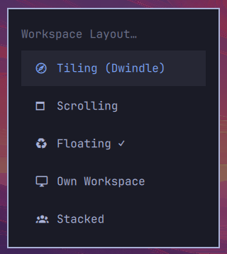

# hyprland-layout

Four switchable workspace modes for [Omarchy](https://omarchy.org) (Hyprland), built for
small screens where every pixel counts. One Lua module, one `require` line, no plugins.



**Default: `float`** — a traditional floating WM (XFCE/KDE/GNOME style): apps open at their
natural size on the current workspace, snap to halves, maximize/restore cleanly, and the
focused window is always on top.

Integrates with the **Omarchy menu** (`Trigger > Toggle > Workspace Layout`): the stock
dwindle/scrolling toggle becomes a five-way picker — Tiling (Dwindle), Scrolling, Floating,
Own Workspace, Stacked — with a ✓ on the active layout.

## Modes (cycle with `Hyper+Space`)

| Mode | Behavior |
|---|---|
| `float` *(default)* | Apps float on the **current workspace** at natural size. Resize once → size is remembered per app (`persistent_size`). |
| `own` | Every new app gets **its own workspace** — nothing shares until you move it there. Closing a workspace's last window returns you to the previous one. |
| `stacked` | Everything opens **maximized on workspace 1** (Monocle layout), one window visible at a time. |
| `tiling` | Stock Hyprland dwindle tiling — nothing touched. |

The choice persists across reloads and reboots.

## Omarchy menu & CLI

Besides `Hyper+Space`, layouts can be picked from the Omarchy menu
(`Trigger > Toggle > Workspace Layout`) or set from the shell:

```sh
hyprland-layout-set float      # or: own | stacked | tiling | scrolling
hyprland-layout-set current    # print the active layout
```

`tiling`/`scrolling` match Omarchy's stock per-workspace layouts (dwindle vs scrolling
strip) and first leave any global mode so windows tile again. `float`/`own`/`stacked`
are the global modes from the table above.

## Keys

| Keys | Action |
|---|---|
| `Hyper+Space` | Cycle mode (own → float → stacked → tiling) |
| `Hyper+←/→/↑/↓` | Snap floating window to screen half |
| `Super+Alt+F` | Maximize / restore (float-safe) |
| `Alt+Tab` / `Hyper+Tab` | Cycle windows (mode-aware; raises on top) |
| `Super+F` | True fullscreen (stock Omarchy) |

**Hyper** = `MOD3` (e.g. Caps Lock mapped to Hyper). Focused floating windows are always
raised, so `Hyper+A/B/…`-style launch-or-focus binds land on top, not behind.

## Install

```sh
git clone https://github.com/kholis/hyprland-layout.git
cd hyprland-layout && ./install.sh
```

The installer deploys `hypr/workspaces.lua` to `~/.config/hypr/`, adds one
`require("hypr.workspaces")` line to `hyprland.lua` (backing up anything it replaces),
installs the `hyprland-layout-set` CLI to `~/.local/bin/`, and merges the menu entries
into `~/.config/omarchy/extensions/omarchy-menu.jsonc` (between `>>> hyprland-layout >>>`
sentinels, never duplicating on re-run). It validates with `hyprctl configerrors`.
Re-running is safe.

## Uninstall

```sh
./uninstall.sh
```

## Requirements

- Omarchy with the Lua Hyprland config (Hyprland 0.55+; `persistent_size` 0.53+,
  Monocle 0.55+ — any recent Omarchy is fine)

## Customize

Edit `~/.config/hypr/workspaces.lua`:

- `default_mode` — starting mode (`"float"`, `"own"`, `"stacked"`, `"tiling"`)
- `keep_classes` — apps never auto-relocated in `own` mode

## License

[MIT](LICENSE)
